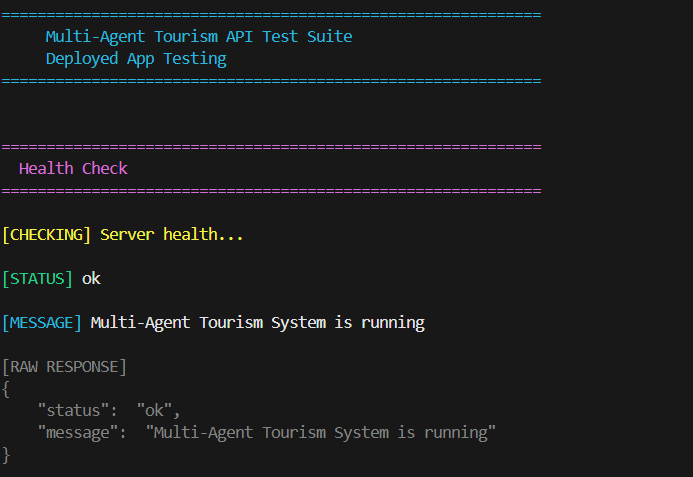
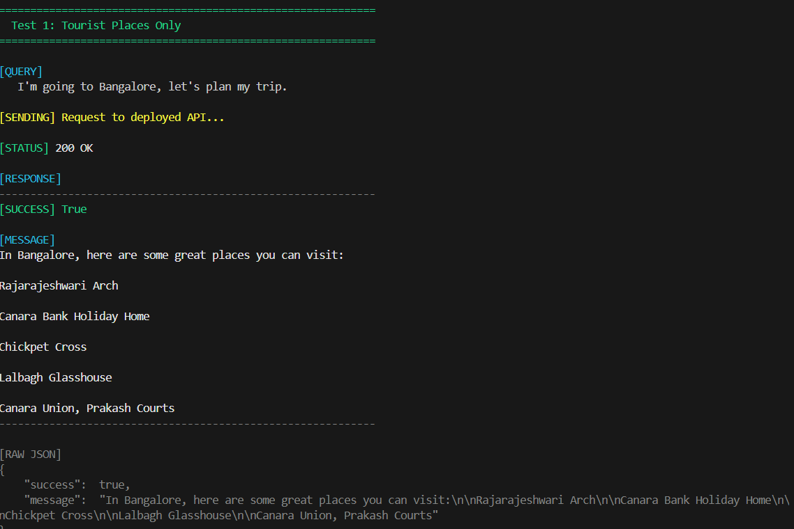
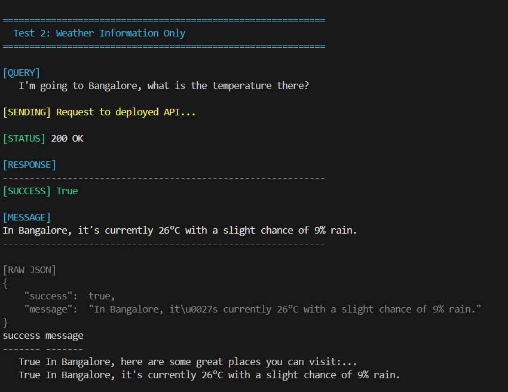
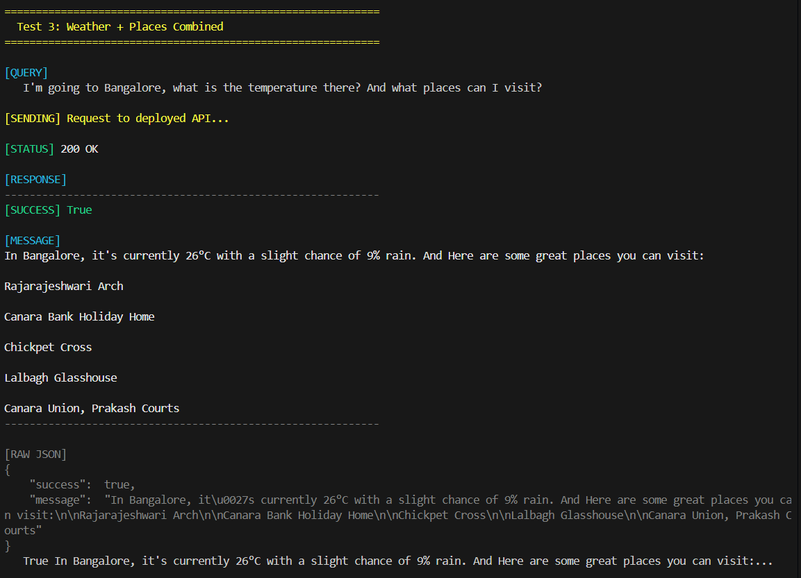
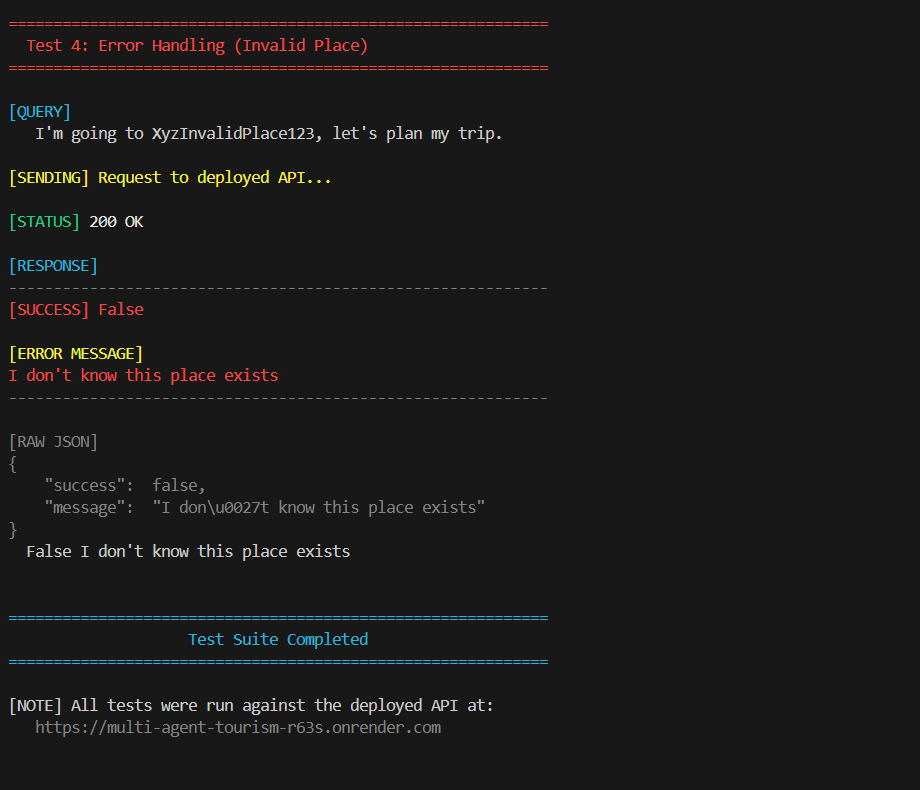

# 🌍 Multi-Agent Tourism System


> A production-ready, multi-agent tourism system that provides weather information and tourist attraction suggestions using natural language processing and real-world APIs.

Built for the **Inkle.ai AI Intern Assignment** 🚀

---

## 📋 Table of Contents

- [Overview](#-overview)
- [Architecture](#-architecture)
- [Features](#-features)
- [Project Structure](#-project-structure)
- [Getting Started](#-getting-started)
- [API Documentation](#-api-documentation)
- [PowerShell Examples](#-powershell-examples)
- [Deployment](#-deployment)
- [License](#-license)

---

## 🎯 Overview

The **Multi-Agent Tourism System** is an intelligent Node.js application that processes natural language queries about travel destinations. The system uses a sophisticated multi-agent architecture to:

- 🧠 **Parse user intent** from natural language queries
- 🌤️ **Fetch real-time weather data** using Open-Meteo API
- 🗺️ **Suggest tourist attractions** using Overpass API (OpenStreetMap)
- 📍 **Geocode locations** using Nominatim API
- 💬 **Return human-like, natural language responses**

### Key Capabilities

- **Intent Detection**: Automatically identifies whether users want weather, places, or both
- **Multi-Agent Orchestration**: Parent agent coordinates child agents (Weather Agent & Places Agent)
- **Real API Integration**: All data comes from live APIs, not AI knowledge
- **Error Handling**: Gracefully handles invalid places with the exact message: *"I don't know this place exists"*
- **Human-Like Output**: Returns natural, conversational responses

---

## 🏗️ Architecture

### System Flow

```
┌─────────────┐
│   User      │
│   Query     │
└──────┬──────┘
       │
       ▼
┌─────────────────────────────────┐
│   Parent Agent                  │
│   (Tourism AI Agent)            │
│   - Parses intent               │
│   - Extracts place name         │
│   - Orchestrates child agents    │
└──────┬──────────────────────────┘
       │
       ├─────────────────┬─────────────────┐
       │                 │                 │
       ▼                 ▼                 ▼
┌─────────────┐   ┌─────────────┐   ┌─────────────┐
│  Geocoding  │   │   Weather    │   │   Places    │
│   Service   │   │    Agent     │   │    Agent    │
│ (Nominatim) │   │              │   │              │
└──────┬──────┘   └──────┬───────┘   └──────┬──────┘
       │                 │                 │
       │                 ▼                 ▼
       │         ┌─────────────┐   ┌─────────────┐
       │         │  Open-Meteo │   │   Overpass   │
       │         │     API     │   │     API      │
       │         └─────────────┘   └─────────────┘
       │
       ▼
┌─────────────┐
│   Response  │
│  (Natural   │
│  Language)  │
└─────────────┘
```

### Agent Responsibilities

| Agent | Responsibility | API Used |
|-------|---------------|----------|
| **Parent Agent** | Orchestrates system, parses user intent, coordinates child agents | N/A |
| **Weather Agent** | Fetches current weather and forecast data | Open-Meteo |
| **Places Agent** | Retrieves tourist attractions and places of interest | Overpass |
| **Geocoding Service** | Converts place names to coordinates | Nominatim |

---

## ✨ Features

- ⚡ **Multi-Agent Architecture**: Clean separation of concerns with parent and child agents
- 🌤️ **Real-Time Weather Data**: Current temperature and precipitation probability via Open-Meteo
- 🗺️ **Tourist Attractions**: Up to 5 curated places of interest via Overpass API
- 📍 **Geocoding**: Automatic location resolution using Nominatim
- 🧠 **Natural Language Processing**: Intelligent intent extraction and place name parsing
- 💬 **Human-Like Responses**: Conversational, natural language output
- 🛡️ **Robust Error Handling**: Graceful handling of invalid places and API failures
- 🚀 **Production-Ready**: Clean architecture, CORS enabled, environment variable support

---

## 📁 Project Structure

```
Multi-Agent Tourism/
├── index.js                    # Server bootstrap and Express app setup
├── routes/
│   └── ai.js                  # POST /api/ask route handler
├── controllers/
│   └── aiController.js         # Main orchestrator (Parent Agent)
├── utils/
│   └── parser.js               # Natural language parsing (extract place + intent)
├── services/
│   ├── geocodeService.js       # Nominatim API service (geocoding)
│   ├── weatherService.js       # Open-Meteo API service
│   └── placeService.js         # Overpass API service
├── agents/
│   ├── weatherAgent.js         # Weather Agent
│   └── placesAgent.js          # Places Agent
├── package.json                 # Dependencies and scripts
├── .env.example                 # Environment variables template
├── .gitignore                   # Git ignore rules
└── README.md                    # This file
```

---

## 🚀 Getting Started

### Prerequisites

- **Node.js** (v14 or higher) - [Download](https://nodejs.org/)
- **npm** (comes with Node.js) or **yarn**

### Installation

1. **Clone the repository:**
   ```powershell
   git clone <repository-url>
   cd "Multi-Agent Tourism"
   ```

2. **Install dependencies:**
   ```powershell
   npm install
   ```

3. **Create environment file:**
   ```powershell
   # Copy the example file
   Copy-Item .env.example .env
   
   # Or create manually
   New-Item -Path .env -ItemType File
   ```

4. **Configure environment variables:**
   
   Edit `.env` file:
   ```env
   PORT=3000
   ```
   
   > **Note**: The APIs used (Open-Meteo, Overpass, Nominatim) don't require API keys. They are free and open-source services.

5. **Start the server:**
   
   **Development mode (with auto-reload):**
   ```powershell
   npm run dev
   ```
   
   **Production mode:**
   ```powershell
   npm start
   ```

6. **Verify the server is running:**
   
   You should see:
   ```
   ✓ Routes loaded successfully
   ✓ Routes mounted at /api
   Server is running on port 3000
   
   Available endpoints:
     GET  http://localhost:3000/health
     POST http://localhost:3000/api/ask
   ```

---

## 📡 API Documentation

### POST /api/ask

Main endpoint for tourism queries. Accepts natural language input and returns weather and/or tourist attraction information.

**Endpoint:** `POST http://localhost:3000/api/ask`

**Request Body:**
```json
{
  "query": "I'm going to go to Bangalore, let's plan my trip."
}
```

**Success Response (200):**
```json
{
  "success": true,
  "message": "In Bangalore, here are some great places you can visit:\n\nLalbagh\n\nSri Chamarajendra Park\n\nBangalore palace\n\nBannerghatta National Park\n\nJawaharlal Nehru Planetarium"
}
```

**Error Response (200):**
```json
{
  "success": false,
  "message": "I don't know this place exists"
}
```

**Status Codes:**
- `200 OK` - Request processed successfully (both success and error cases return 200)
- `400 Bad Request` - Missing or invalid request body
- `500 Internal Server Error` - Server error

**Notes:**
- The endpoint uses natural language processing to extract the place name and user intent
- Supports queries asking for weather, places, or both
- Returns human-like, conversational responses
- All place names are automatically geocoded using Nominatim

### GET /health

Health check endpoint to verify the server is running.

**Endpoint:** `GET http://localhost:3000/health`

**Response:**
```json
{
  "status": "ok",
  "message": "Multi-Agent Tourism System is running"
}
```

---

## 🔍 How to Test the Deployed App (Important for Evaluators)

This project is a backend API, not a webpage.  
Opening the root URL will show:

```json
{"error":"Route not found"}
```

This is expected.

### ✔ Health Check (works in any browser)

https://multi-agent-tourism-r63s.onrender.com/health

### ✔ Main API Endpoint (POST Request)

POST https://multi-agent-tourism-r63s.onrender.com/api/ask

**Quick Test with PowerShell (Human-Readable Output):**

Use the provided test script for beautiful, formatted output:

```powershell
# Run all test cases with formatted output
.\test-deployed-api.ps1

# Or test a single query
.\quick-test.ps1 "I'm going to go to Bangalore, let's plan my trip."
```

**Manual PowerShell Test (One-liner):**

```powershell
$body = @{ query = "I'm going to go to Bangalore, let's plan my trip." } | ConvertTo-Json
$response = Invoke-WebRequest -Uri "https://multi-agent-tourism-r63s.onrender.com/api/ask" -Method POST -Body $body -ContentType "application/json"
$json = $response.Content | ConvertFrom-Json
Write-Host "Status: $($response.StatusCode)" -ForegroundColor Green
Write-Host "Success: $($json.success)" -ForegroundColor $(if($json.success){"Green"}else{"Red"})
Write-Host "`nMessage:" -ForegroundColor Cyan
Write-Host ($json.message -replace "\\n", "`n") -ForegroundColor White
```

### ⭐ Sample Test Bodies

#### 1. Tourist Places Only

```json
{
  "query": "I'm going to go to Bangalore, let's plan my trip."
}
```

#### 2. Weather Only

```json
{
  "query": "I'm going to Bangalore, what is the temperature there?"
}
```

#### 3. Weather + Places

```json
{
  "query": "I'm going to Bangalore, what is the temperature there? And what places can I visit?"
}
```

#### 4. Invalid / Unknown Place

```json
{
  "query": "I'm going to go to XyzInvalidPlace123, let's plan my trip."
}
```

Expected response:

```
I don't know this place exists
```

### 📸 Screenshots of Working Deployed App

#### Health Check Endpoint (Browser)

*Health check endpoint showing the API is running*

#### Postman/API Testing Tool Screenshots

**1. Tourist Places Request & Response:**

*Example: Testing the places endpoint with Postman/Thunder Client*

**2. Weather Request & Response:**

*Example: Testing the weather endpoint*

**3. Combined Weather + Places Request & Response:**

*Example: Testing both weather and places in one request*

**4. Error Handling (Invalid Place):**

*Example: Testing error handling with invalid place name*

> **Note**: Screenshots should show:
> - The request body (JSON)
> - The response body (JSON)
> - Status code (200 OK)
> - The deployed URL (https://multi-agent-tourism-r63s.onrender.com/api/ask)

---

## 💻 PowerShell Examples

All examples use PowerShell's `Invoke-WebRequest` cmdlet. The response can be formatted using `ConvertFrom-Json` for better readability.

### Example 1: Get Tourist Places Only

```powershell
$body = @{ 
  query = "I'm going to go to Bangalore, let's plan my trip." 
} | ConvertTo-Json

$response = Invoke-WebRequest -Uri "http://localhost:3000/api/ask" -Method POST -Body $body -ContentType "application/json"

# Display formatted response
$json = $response.Content | ConvertFrom-Json
Write-Host $json.message
```

**Expected Output:**
```
In Bangalore, here are some great places you can visit:

Rajarajeshwari Arch

Canara Bank Holiday Home

Chickpet Cross

Lalbagh Glasshouse

Canara Union, Prakash Courts
```

### Example 2: Get Weather Information Only

```powershell
$body = @{ 
  query = "I'm going to go to Bangalore, what is the temperature there" 
} | ConvertTo-Json

$response = Invoke-WebRequest -Uri "http://localhost:3000/api/ask" -Method POST -Body $body -ContentType "application/json"

# Display formatted response
$json = $response.Content | ConvertFrom-Json
Write-Host $json.message
```

**Expected Output:**
```
In Bangalore, it's currently 20°C with no chance of rain.
```

### Example 3: Get Both Weather and Places

```powershell
$body = @{ 
  query = "I'm going to go to Bangalore, what is the temperature there? And what are the places I can visit?" 
} | ConvertTo-Json

$response = Invoke-WebRequest -Uri "http://localhost:3000/api/ask" -Method POST -Body $body -ContentType "application/json"

# Display formatted response
$json = $response.Content | ConvertFrom-Json
Write-Host $json.message
```

**Expected Output:**
```
In Bangalore, it's currently 20°C with no chance of rain. And Here are some great places you can visit:

Rajarajeshwari Arch

Canara Bank Holiday Home

Chickpet Cross

Lalbagh Glasshouse

Canara Union, Prakash Courts
```

### Example 4: Test Error Handling (Unknown Place)

```powershell
$body = @{ 
  query = "I'm going to go to XyzInvalidPlace123, let's plan my trip." 
} | ConvertTo-Json

$response = Invoke-WebRequest -Uri "http://localhost:3000/api/ask" -Method POST -Body $body -ContentType "application/json"

# Display formatted response
$json = $response.Content | ConvertFrom-Json
Write-Host "Success: $($json.success)"
Write-Host "Message: $($json.message)"
```

**Expected Output:**
```
Success: False
Message: I don't know this place exists
```

### Quick Test Script

Save this as `test-api.ps1`:

```powershell
# Test Places
Write-Host "`n=== Testing Places ===" -ForegroundColor Green
$body = @{ query = "I'm going to go to Paris, let's plan my trip." } | ConvertTo-Json
$response = Invoke-WebRequest -Uri "http://localhost:3000/api/ask" -Method POST -Body $body -ContentType "application/json"
$json = $response.Content | ConvertFrom-Json
Write-Host $json.message

# Test Weather
Write-Host "`n=== Testing Weather ===" -ForegroundColor Cyan
$body = @{ query = "I'm going to go to Tokyo, what is the temperature there" } | ConvertTo-Json
$response = Invoke-WebRequest -Uri "http://localhost:3000/api/ask" -Method POST -Body $body -ContentType "application/json"
$json = $response.Content | ConvertFrom-Json
Write-Host $json.message

# Test Both
Write-Host "`n=== Testing Both ===" -ForegroundColor Yellow
$body = @{ query = "I'm going to go to New York, what is the temperature there? And what are the places I can visit?" } | ConvertTo-Json
$response = Invoke-WebRequest -Uri "http://localhost:3000/api/ask" -Method POST -Body $body -ContentType "application/json"
$json = $response.Content | ConvertFrom-Json
Write-Host $json.message
```

Run with:
```powershell
.\test-api.ps1
```

---

## 🚢 Deployment

### Deploying to Render

[Render](https://render.com) is a cloud platform that makes it easy to deploy Node.js applications.

#### Step 1: Prepare Your Repository

1. Ensure all code is committed to a Git repository (GitHub, GitLab, or Bitbucket)
2. Verify `package.json` includes the `start` script:
   ```json
   {
     "scripts": {
       "start": "node index.js",
       "dev": "nodemon index.js"
     }
   }
   ```

#### Step 2: Create a Render Web Service

1. **Sign up/Login** to [Render](https://render.com)

2. **Create New Web Service:**
   - Click **"New +"** → **"Web Service"**
   - Connect your Git repository
   - Select the repository containing this project

3. **Configure the Service:**
   - **Name:** `multi-agent-tourism` (or your preferred name)
   - **Environment:** `Node`
   - **Build Command:** `npm install`
   - **Start Command:** `npm start`
   - **Plan:** Free tier is sufficient for testing

4. **Environment Variables:**
   - Render automatically provides `PORT` environment variable
   - No additional API keys needed (all APIs are free and open-source)

5. **Deploy:**
   - Click **"Create Web Service"**
   - Render will automatically build and deploy your application
   - Your service will be available at `https://your-app-name.onrender.com`

#### Step 3: Test Deployment

Once deployed, test your endpoint:

```powershell
$body = @{ 
  query = "I'm going to go to Paris, let's plan my trip." 
} | ConvertTo-Json

$response = Invoke-WebRequest -Uri "https://your-app-name.onrender.com/api/ask" -Method POST -Body $body -ContentType "application/json"
$json = $response.Content | ConvertFrom-Json
Write-Host $json.message
```

#### Render-Specific Notes

- ⚠️ **Free Tier**: May spin down after inactivity (cold start delay of ~30 seconds)
- 🔄 **Auto-Deploy**: Automatically deploys on every push to the main branch
- 📊 **Logs**: View real-time logs in the Render dashboard
- 🔒 **HTTPS**: Automatically enabled for all services
- 💰 **Production**: Consider upgrading to a paid plan for better performance and no cold starts

---

## 📸 Screenshots & Demo

### Local Development Examples


*Example: Tourist places response for Bangalore (local testing)*


*Example: Weather information response (local testing)*


*Example: Combined weather and places response (local testing)*

### Deployed App Screenshots

See the [How to Test the Deployed App](#-how-to-test-the-deployed-app-important-for-evaluators) section above for screenshots of the live deployed API.

### How to Take Screenshots

1. **For Health Check:**
   - Open `https://multi-agent-tourism-r63s.onrender.com/health` in a browser
   - Take a screenshot showing the JSON response

2. **For API Endpoints (Postman/Thunder Client/Insomnia):**
   - Set method to `POST`
   - URL: `https://multi-agent-tourism-r63s.onrender.com/api/ask`
   - Headers: `Content-Type: application/json`
   - Body: Use the sample test bodies from above
   - Take screenshots showing:
     - Request configuration (URL, method, headers, body)
     - Response (status code, response body)
   - Save screenshots as:
     - `deployed-health-check.png`
     - `deployed-places-test.png`
     - `deployed-weather-test.png`
     - `deployed-combined-test.png`
     - `deployed-error-test.png`

3. **Save screenshots in the `images/` directory**

> **Note**: Add your screenshots to the `images/` directory to showcase the system in action.

---

## 🛠️ Development

### Available Scripts

- `npm start` - Start the production server
- `npm run dev` - Start the development server with nodemon (auto-reload on file changes)

### Adding New Features

The architecture is designed to be extensible:

1. **New Agent**: Create a new file in `/agents/` directory
2. **New Service**: Create a new file in `/services/` directory
3. **Update Controller**: Modify `/controllers/aiController.js` to integrate new agents
4. **Update Parser**: Modify `/utils/parser.js` to detect new intents

### Project Dependencies

- **express** - Web framework for Node.js
- **axios** - HTTP client for API requests
- **cors** - Cross-Origin Resource Sharing middleware
- **dotenv** - Environment variable management

### Development Dependencies

- **nodemon** - Auto-restart server during development

---

## 🌐 APIs Used

### 1. Open-Meteo API (Weather)

- **Endpoint:** `https://api.open-meteo.com/v1/forecast`
- **Documentation:** [https://open-meteo.com/en/docs](https://open-meteo.com/en/docs)
- **Purpose:** Current weather and forecast data
- **API Key:** Not required (free and open-source)

### 2. Overpass API (Places/Tourism)

- **Endpoint:** `https://overpass-api.de/api/interpreter`
- **Documentation:** [https://wiki.openstreetmap.org/wiki/Overpass_API](https://wiki.openstreetmap.org/wiki/Overpass_API)
- **Purpose:** Tourist attractions and places of interest from OpenStreetMap
- **API Key:** Not required (free and open-source)

### 3. Nominatim API (Geocoding)

- **Endpoint:** `https://nominatim.openstreetmap.org/search`
- **Documentation:** [https://nominatim.org/release-docs/develop/api/Search/](https://nominatim.org/release-docs/develop/api/Search/)
- **Purpose:** Convert place names to coordinates (latitude, longitude)
- **API Key:** Not required (free and open-source)
- **Note:** Includes proper User-Agent header as required by Nominatim usage policy

---

## ⚠️ Error Handling

The system handles errors gracefully:

- ❌ **Invalid place names** → Returns: `"I don't know this place exists"`
- 🌐 **API failures** → Returns appropriate error messages
- ⏱️ **Network timeouts** → Handled with timeout configurations
- 📍 **Missing coordinates** → Returns: `"I don't know this place exists"`
- 🔄 **Service unavailable** → Graceful degradation with error messages

---

## 📝 License

This project is licensed under the **MIT License**.

```
MIT License

Copyright (c) 2024 Multi-Agent Tourism System

Permission is hereby granted, free of charge, to any person obtaining a copy
of this software and associated documentation files (the "Software"), to deal
in the Software without restriction, including without limitation the rights
to use, copy, modify, merge, publish, distribute, sublicense, and/or sell
copies of the Software, and to permit persons to whom the Software is
furnished to do so, subject to the following conditions:

The above copyright notice and this permission notice shall be included in all
copies or substantial portions of the Software.

THE SOFTWARE IS PROVIDED "AS IS", WITHOUT WARRANTY OF ANY KIND, EXPRESS OR
IMPLIED, INCLUDING BUT NOT LIMITED TO THE WARRANTIES OF MERCHANTABILITY,
FITNESS FOR A PARTICULAR PURPOSE AND NONINFRINGEMENT. IN NO EVENT SHALL THE
AUTHORS OR COPYRIGHT HOLDERS BE LIABLE FOR ANY CLAIM, DAMAGES OR OTHER
LIABILITY, WHETHER IN AN ACTION OF CONTRACT, TORT OR OTHERWISE, ARISING FROM,
OUT OF OR IN CONNECTION WITH THE SOFTWARE OR THE USE OR OTHER DEALINGS IN THE
SOFTWARE.
```

---

## 🤝 Contributing

This project was built for the **Inkle.ai AI Intern Assignment**. Feel free to:

- ⭐ Star the repository
- 🐛 Report bugs
- 💡 Suggest enhancements
- 🔧 Submit pull requests

---

## 📧 Contact & Support

For questions or issues related to this project, please open an issue on GitHub.

---

<div align="center">


[Node.js](https://nodejs.org/) • [Express](https://expressjs.com/) • [Open-Meteo](https://open-meteo.com/) • [Overpass](https://wiki.openstreetmap.org/wiki/Overpass_API) • [Nominatim](https://nominatim.org/)

</div>
